# Buddingpreneurs – Startup Training & Empowerment Platform
## Master Site Architecture & Content Blueprint

This document provides a highly structured and comprehensive overview of the site architecture, copy blocks, heading hierarchy, and asset mapping for the **Buddingpreneurs** web platform, compiled during our deep crawl of `https://buddingpreneurs.in/`. 

It serves as a production-ready architectural guide for the upcoming design and frontend engineering phase.

---

## 🗺️ Site Architecture Mapping

```mermaid
graph TD
    Home["🏠 Home (/)"] --> Programs["🎯 Our Programs (/our-programs)"]
    Home --> Workshops["🎓 Workshops (/workshops)"]
    Home --> Membership["💼 Business Plan (/business-plan)"]
    Home --> Community["🤝 Community (/community)"]
    Home --> Blog["📝 Blog (/blog)"]
    Home --> About["ℹ️ About Us (/about-us)"]
    Home --> Contact["✉️ Contact (/contact)"]
    Home --> Disclaimer["⚠️ Disclaimer (/disclaimer)"]

    style Home fill:#7c3aed,stroke:#fff,stroke-width:2px,color:#fff
    style Programs fill:#c084fc,stroke:#333,stroke-width:1px,color:#000
    style Workshops fill:#c084fc,stroke:#333,stroke-width:1px,color:#000
    style Membership fill:#c084fc,stroke:#333,stroke-width:1px,color:#000
    style Community fill:#c084fc,stroke:#333,stroke-width:1px,color:#000
    style Blog fill:#f3e8ff,stroke:#333,stroke-width:1px,color:#000
    style About fill:#f3e8ff,stroke:#333,stroke-width:1px,color:#000
    style Contact fill:#f3e8ff,stroke:#333,stroke-width:1px,color:#000
    style Disclaimer fill:#f3e8ff,stroke:#333,stroke-width:1px,color:#000
```

---

## 📄 Detailed Page-by-Page Textual & Asset Map

### 1. 🏠 Home Page (`/`)
* **Title:** Buddingpreneurs – Startup Training & Empowerment Platform for Indian Women
* **Layout Directory:** `images/home`
* **Heading Hierarchy:**
  - `H1`: Welcome to Buddingpreneurs Celebrating Women-Led Businesses.
  - `H2`: Start Small, Dream Big — Women Entrepreneurs Rise Here
  - `H2`: Our Community Speaks
  - `H3`: 🏆 Recognition
  - `H3`: Get In Touch
  - `H3`: Our Clients
* **Core Copy & Text Blocks:**
  > "Buddingpreneurs is a vibrant community dedicated to empowering Indian women through skill development, collaboration, and support, fostering independence and economic growth in their entrepreneurial journeys. We believe in the power of community. Through hands-on training, digital tools, and peer support, we help women turn ideas into income."
  > 
  > "Every big journey begins with a small step — and at Buddingpreneur, we help women take that first leap through our Start-up program. With the right skills, guidance, and community, women can turn simple ideas into powerful ventures."
* **Primary Call to Action:** "Connect. Collaborate. Grow."
* **Visual Assets:**
  - Logo: `images/home/logo_budding-removebg-preview-1-mjE7V4a2Zofraqj9.png`
  - Hero image (women working on laptop): `images/home/photo-1590650423710-ffa6e7f63440`
  - Recognition Awards: `images/home/screenshot-16-YX4lrxoGwbC91XyD.png` to `screenshot-24-mP4O0KeZxkiLLP8J.png`

---

### 2. 🎓 Workshops Page (`/workshops`)
* **Title:** Skill Development & Startup Workshops for Women
* **Layout Directory:** `images/workshops`
* **Heading Hierarchy:**
  - `H1`: Enable Women to Lead and Launch
  - `H2`: Grow Her Ideas into Impact
* **Core Copy & Text Blocks:**
  > "Join our empowering Skill Development Workshop designed for Indian women entrepreneurs. Learn essential skills in brand promotion on Facebook, Instagram, and WhatsApp. Collaborate with fellow women to enhance your business acumen and achieve economic independence."
  > 
  > "Enroll your kids in our engaging Online Workshop tailored for young minds. This interactive session focuses on skill development and creativity, fostering a supportive environment for children to learn and grow."
* **Visual Assets:**
  - Magazine Cover ("Secret Women's Business"): `images/workshops/photo-1623683704451-ca4299bb3c99`
  - Yoga session imagery: `images/workshops/photo-1510894347713-fc3ed6fdf539`
  - Group community image: `images/workshops/photo-1665753697122-2e3426c2abaf`

---

### 3. 🎯 Our Programs Page (`/our-programs`)
* **Title:** Startup & Skill Programs for Women
* **Layout Directory:** `images/our-programs`
* **Heading Hierarchy:**
  - `H1`: "The Startup for women: Powering Women to Rise and Thrive"
  - `H2`: What Skills Do We Teach?
  - `H2`: Workshop Formats
  - `H2`: How to Register
  - `H1`: Brand Promotion Training
  - `H2`: What We Teach
  - `H2`: Hands-On Training Tools
* **Core Copy & Text Blocks:**
  - **Ecosystem Elements:**
    - *A Quality Platform with a Cream Audience*: Connect with like-minded entrepreneurs.
    - *Skill Development*: Expert-led sessions on business, marketing, finance, and wellness.
    - *Paid Campaigns*: Earn through paid brand promotions, influencer partnerships.
    - *Referral Rewards*: Invite members and unlock community growth rewards.
  - **Skill Focus Areas:**
    - **Crafts**: Handmade decor, jewelry making, mehndi, gift wrapping.
    - **Digital**: Content creation, Canva design, photo/video editing, e-commerce basics.
    - **Marketing**: FB/Instagram promotion, WhatsApp catalog setup, organic audience reach.
    - **Kids' Enrichment**: Vedic Math, Abacus, Calligraphy, Arts & Crafts.
* **Visual Assets:**
  - Collaborative meeting image: `images/our-programs/photo-1590650046871-92c887180603`
  - Teamwork focus: `images/our-programs/photo-1522543558187-768b6df7c25c`

---

### 4. 💼 Business Plan/Membership Page (`/business-plan`)
* **Title:** Business Plans for Women Entrepreneurs
* **Layout Directory:** `images/business-plan` (shared with root styles)
* **Heading Hierarchy:**
  - `H1`: Ideal Membership Structure for Entrepreneur Community. Choose your plans that's right for your Business.
* **Membership Plans Mapping:**

| Plan Tier | Ideal For | Key Features & Value Proposition |
| :--- | :--- | :--- |
| **Free Membership** | Beginners & curious founders | Lifetime access to basic groups, monthly business newsletter, weekend promo opportunities. |
| **Startup Plan** | Early-stage startup founders | Showcase venture on social networks, monthly coaching, video interview spotlight ("Coffee Tales"). |
| **Premium Plan** | Scaling small businesses | All Startup benefits + pitch feedback events, newsletter spotlights, directory listing, E-Certificates. |
| **VIP / Pro Plan** | Funded & mature startups | 1-on-1 mentoring, high-level masterminds, investor intros, website spotlight, private retreats. |

---

### 5. 🤝 Community Page (`/community`)
* **Title:** Women Entrepreneur Community & Support
* **Layout Directory:** `images/community`
* **Heading Hierarchy:**
  - `H1`: A Platform for Her to Start, Share, and Shine
  - `H2`: Let’s Build Your Dream Together — Get in Touch!
  - `H2`: Gallery
* **Core Copy & Text Blocks:**
  - **Social Proof / Review Block:**
    > "The buddingpreneurs has been an invaluable resource for learning, networking, and refining entrepreneurial skills. We trust buddingpreneurs. Must try... see the difference." 
    > — **Nirmla Chib** (Entrepreneur & Brand MD, TVAREETAZ) ★★★★★
* **Visual Assets:**
  - Offline startup showcase event: `images/community/whatsapp-image-2025-05-18-at-8.28.51-am-m5KM9kNZVMsOW363.jpeg`
  - Women mastermind meeting: `images/community/photo-1564445476463-7833c341e914`

---

### 6. 📝 Blog Page (`/blog`)
* **Title:** Startup Stories & Tips for Women | Buddingpreneurs Blog
* **Layout Directory:** `images/blog`
* **Heading Hierarchy:**
  - `H1`: "Empower Her Dreams: Startups That Start at Home"
* **Visual Assets:**
  - Women marching in solidarity: `images/blog/photo-1678928608031-3eb501c794ab`

---

### 7. ℹ️ About Us Page (`/about-us`)
* **Title:** About Us – Mission to Empower Indian Women Entrepreneurs
* **Layout Directory:** `images/about-us`
* **Heading Hierarchy:**
  - `H1`: Fostering Economic Independence Through Community
  - `H2`: Our Founding Vision
* **Core Copy:**
  > "Buddingpreneurs was founded with a singular, clear vision: to ensure no Indian woman has to put her dreams on hold due to lack of guidance, resources, or technical skills. We bridges the gap between home-based production and professional digital branding, helping everyday skills blossom into sustainable business engines."

---

### 8. ✉️ Contact Page (`/contact`)
* **Title:** Contact Buddingpreneurs – Join Our Circle
* **Layout Directory:** `images/contact`
* **Heading Hierarchy:**
  - `H1`: Let's Connect
  - `H2`: Drop Us a Line or Join Our Groups
* **Core Contacts:**
  - **Email:** `buddingpreneursinfo@gmail.com`
  - **Location/Base:** Dehradun, Uttarakhand, India
  - **Primary Channels:** WhatsApp Business, Facebook Community Group, Instagram

---

### 9. ⚠️ Disclaimer Page (`/disclaimer`)
* **Title:** Disclaimer & Terms of Participation
* **Core Copy:**
  - Structural rules regarding membership billing, third-party brand promotions, and content copyright. Ensures legal protections for platform training.

---

## 🎨 Premium Visual Identity Redesign Blueprint

To elevate Buddingpreneurs to a state-of-the-art, premium design that instantly captivates the target audience, we recommend implementing the following design tokens and system elements:

### 1. Color Palette (Harmonious, Empowering HSL)
- **Primary (Royal Amethyst):** `hsl(265, 80%, 45%)` — represents empowerment, leadership, and ambition.
- **Secondary (Soft Rose Blossom):** `hsl(340, 85%, 65%)` — adds a welcoming touch.
- **Background Dark Mode:** `hsl(220, 25%, 9%)` with translucent glassmorphic card overlays.
- **Background Light Mode:** `hsl(260, 20%, 98%)` with light purple gradients.

### 2. Typography (Modern, Elite Pairing)
- **Heading Font:** *Outfit* or *Syne* (Google Fonts) — provides wide, premium, eye-catching hero headers.
- **Body Font:** *Inter* or *Plus Jakarta Sans* — ensures readability for dense course catalogs and membership descriptions.

### 3. Layout Spacing & Bento Grid Pattern
- Utilize gapless or finely borders-separated **Bento Grids** to showcase programs, testimonials, and kids' courses.
- Ensure 24px corner-roundness on buttons and cards (`border-radius: 1.5rem;` for smooth premium visual flow).
